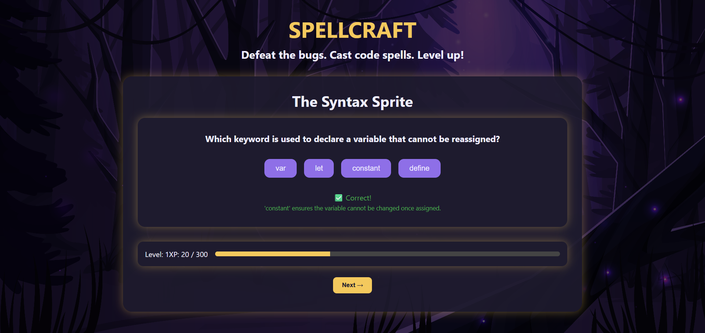

# 🧙‍♂️ SpellCraft – A Magical JavaScript Quiz Game

**SpellCraft** is a fantasy-themed coding quiz game built with HTML, CSS, and JavaScript. Battle through 5 mystical levels, defeat bugs, cast code spells, and level up your programming knowledge — all through an interactive, single-page experience!

---

## ✨ Features

- 🧩 **5 Levels** of increasing difficulty (HTML, JS, DOM, Loops, Advanced JS)
- 🧠 **15 Curated Questions** with feedback & explanations
- 🧪 **XP System** that tracks your progress with a filling XP bar
- 🎮 **Clean UI & Responsive Design** for desktops
- 🔁 Retry incorrect questions and move forward only with the right answers
- 🎉 Game completion screen with restart option

---

## 🚀 Demo

Try the live version here: [🔗 Live Demo](https://spellcraft.netlify.app/)

---

## 🛠️ Tech Stack

- HTML5
- CSS3
- Vanilla JavaScript (No frameworks)
- Responsive Design
- Local image assets for background and layout
